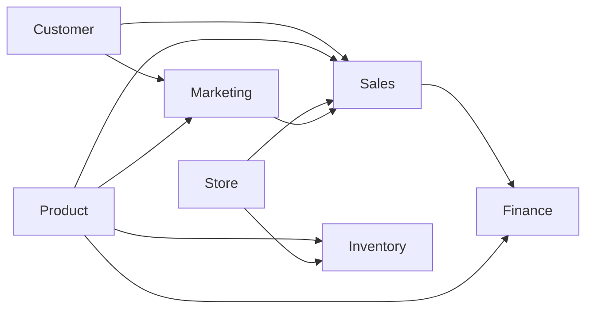

# NovaRetail 业务域关系

> 由 `datasets/schema/catalog.py` 生成。箭头表示主要分析关联，不代表所有物理外键。

目录当前包含 56 张表、816 个字段。

| 业务域 | 表数 |
| --- | ---: |
| Customer | 8 |
| Finance | 8 |
| Inventory | 8 |
| Marketing | 8 |
| Product | 8 |
| Sales | 8 |
| Store | 8 |
